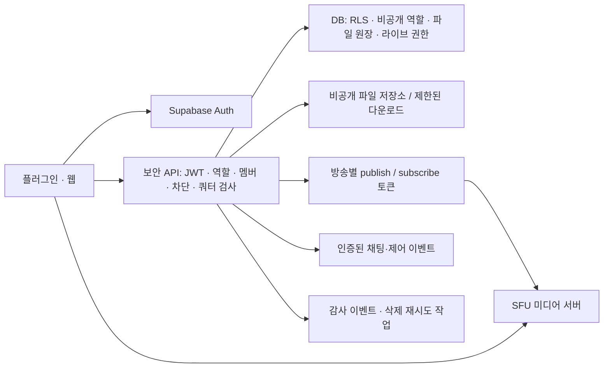

> 구현 후 현황·검증·미완료 항목은 [보안 구현 현황](security-implementation-2026-09-24.md)을 참고하세요. 아래 내용은 최초 진단 기준입니다.

# 보안 현황 및 개발 방향 — 채팅·파일·사용자·라이브

작성일: 2026-09-24 (KST). 코드 기준: `2c386b1` 및 현재 작업 디렉터리의 미커밋 변경 사항.

## 결론과 검토 범위

채팅의 대화방 멤버 기반 RLS와 파일 다운로드 서명 URL 등 기본 보호는 구현되어 있다. 그러나 운영 DB의 관리자 권한 우회, 클라이언트가 지정하는 파일 키의 신뢰, 공개 라이브 신호 채널 때문에 현재 상태를 민감한 협업 자료를 안전하게 다루는 단계로 평가하기 어렵다. 관리자 권한 우회를 가장 먼저 차단하고 파일 권한, 라이브 권한 순서로 보강해야 한다.

- 저장소 코드·SQL과 연결된 `BetterPluginCommunity` Supabase의 시스템 카탈로그, RLS, grants, 함수 정의, Storage 버킷 설정, Security Advisors를 읽기 전용으로 확인했다.
- 사용자 채팅 본문·이메일·실제 파일은 조회하지 않았다. 관리자 RPC 호출, 사용자 권한 변경, 업로드·삭제, 방송 연결을 이용한 공격 재현도 하지 않았다.
- 운영 DB에서 확인한 사실과 로컬 코드상 문제를 구분한다. 로컬 코드와 Vercel 배포본이 같은지는 확인하지 않았다.
- Cloudflare R2 공개 접근·수명주기·IAM, Vercel WAF, Supabase Realtime의 Allow public access, 실제 인증·세션 설정, 백업·로그 보존 설정은 미확인이다.
- 이 문서는 분석 결과다. 서비스 코드나 운영 설정은 변경하지 않았다.

## 현재 데이터 흐름

| 대상 | 구현 | 보호되는 부분 | 남은 경계 |
| --- | --- | --- | --- |
| 로그인 | Supabase Auth 이메일·비밀번호, 웹과 플러그인이 같은 프로젝트 사용 | 비밀번호 처리를 Auth에 위임 | 관리자 권한, MFA, 세션 보관·폐기 |
| DM·그룹 채팅 | 클라이언트 → PostgREST `messages`, Realtime Postgres Changes | SELECT는 대화방 멤버, INSERT는 본인 발신+멤버, DELETE는 본인 발신 | 파일 참조 권한, 초대·퇴장 후 권한, 보존·삭제 |
| 채팅 첨부·스템 | Vercel에서 R2 PUT 서명 발급 → R2 업로드 → DB에 URL·key 기록 | GET 발급은 호출자 JWT로 보이는 메시지/스템의 정확한 key 검사 | 업로드 인증 부재, 임의 key 참조, 공개 URL 우회 |
| 프로필 | `profiles`에 표시명·username·avatar·bio·관리자/인증 표시 | 로그인 사용자 읽기, 본인 수정 정책 | 일반 필드와 권한 필드가 같은 수정 범위 |
| 이메일·로그인 정보 | `auth.users`; 관리자 RPC가 일부 정보 반환 | 일반 프로필 테이블과 분리 | 관리자 RPC의 NULL 권한 검사 오류 |
| 라이브 목록 | `live_sessions` | 운영 RLS: 로그인 사용자 조회, 호스트만 INSERT/DELETE | 공개 범위·차단·역할 모델 없음; UPDATE 정책도 없음 |
| 라이브 영상·음성 | 방송자 → 각 시청자의 개별 WebRTC 연결, STUN/TURN 보조 | WebRTC 전송 암호화 | 시청 권한·신호 발신자 인증·IP 노출·자원 제한 |
| 라이브 채팅 | `live-chat:<sessionId>` Broadcast, 메모리 배열 | 앱 코드상 DB에 영구 저장하지 않음 | 발신자 사칭·도배·퇴장·신고 처리 |

메시지 `content`와 파일은 애플리케이션에서 암호화하지 않은 상태로 서버에 전달된다. 저장 매체 암호화와 별개로, 운영자가 내용을 읽을 수 없는 종단간 암호화(E2EE)는 채팅·파일 경로에 없다. 라이브 WebRTC의 전송 암호화만으로 참가자의 신원이나 시청 권한이 검증되지는 않는다. [WebRTC 보안 표준](https://www.rfc-editor.org/info/rfc8827/)

## 발견 사항

### SEC-01 · P0 · 관리자 RPC의 비로그인 권한 우회 — 운영 DB 확인

`public.admin_get_user_details(uuid)`와 `public.admin_delete_user(uuid)`는 SECURITY DEFINER이며 `anon` 역할에도 EXECUTE가 허용되어 있다. 두 함수의 가드는 다음 형태다.

```sql
IF NOT (SELECT is_admin FROM profiles WHERE id = auth.uid()) THEN
  RAISE EXCEPTION 'Access denied';
END IF;
```

비로그인 사용자는 `auth.uid()`가 NULL이므로 조회 결과도 NULL이다. `NOT NULL`은 TRUE가 아니어서 거부 분기를 건너뛴다. 관리자 정보 함수는 대상 UUID의 이메일·가입일·최종 로그인 시각 등을 반환하며, 삭제 함수는 `auth.users` 삭제를 시도한다. 실제 삭제 성공 여부는 대상의 FK 등에도 영향을 받지만, 권한 검사가 우회되는 문제는 그와 독립적이다.

검증: `has_function_privilege('anon', ..., 'EXECUTE')`가 두 함수에서 모두 true. 실제 사용자 대신 `CASE WHEN NOT (NULL::boolean)` 조건식으로 거부 분기를 건너뛰는 의미를 확인했다. 개인정보 조회·삭제 함수는 호출하지 않았다. 클라이언트 사용 위치: `apps/plugin/src/pages/AdminPage.tsx:127`.

대응: PUBLIC/anon 실행 권한 회수, `auth.uid() IS NULL OR NOT EXISTS (...)` 형태의 명시적 거부, 서버가 관리하는 역할 저장소 사용. 관리자 세션에는 MFA와 중요 작업 재인증을 요구한다. 기존 호출·권한 변경 로그도 검토하되, 이번 확인만으로 침해가 있었다고 단정하지 않는다.

### SEC-02 · P0 · 일반 사용자 자신의 관리자 권한 수정 — 운영 DB 확인

`profiles: update own`은 `auth.uid() = id`만 검사한다. authenticated는 테이블 UPDATE 권한이 있고 `is_admin`, `is_verified` 컬럼 UPDATE 권한도 true다. profiles에 이 변경을 차단하는 사용자 트리거는 없었다. 본인 행에서 관리자 플래그를 올리면 다른 관리자 정책·RPC가 그 값을 신뢰하는 구조다. INSERT 정책도 본인 id만 검사하므로 UPDATE만 수정해서는 부족하다.

대응: 관리자 역할을 일반 프로필에서 분리한 비공개 테이블로 이동하고 변경 경로를 서버로 제한한다. 프로필 INSERT/UPDATE에는 허용할 일반 컬럼만 권한을 부여한다. 표시용 인증 배지도 사용자 수정에서 제외한다. 기존 관리자가 누구인지 별도 신뢰 가능한 기준으로 대조한다.

### SEC-03 · P1 · 파일 업로드 서명 URL에 인증·사용량 제한 없음 — 코드 확인

`apps/plugin/api/r2-upload-url.ts:80`은 요청 본문의 `userId`, `scope`, `contentType`을 받아 15분짜리 PUT URL을 만든다. JWT 검증이나 대화방 멤버 확인, 서버 측 파일 용량·사용량 제한이 없다. 임의 사용자 경로의 새 객체 생성과 저장소·전송 비용 악용이 가능하다. 랜덤 key 때문에 기존 파일 덮어쓰기가 곧바로 가능하다는 뜻은 아니다.

`apps/plugin/src/lib/limits.ts`의 파일 크기 제한은 정상 클라이언트에만 적용된다. CORS 제한도 인증의 대체재가 아니다.

대응: 인증한 JWT에서 user id를 얻고 서버가 object key를 생성한다. 업로드 목적·대화방·크기·형식·쿼터를 검사하고, 완료 검증 전 객체는 격리한다. 실제 크기·MIME·파일 signature·checksum을 확인하고 용도에 따라 악성 파일 검사를 적용한다. 대용량은 업로드 세션·multipart 완료 단계까지 제한해야 한다.

### SEC-04 · P1 · 메시지의 파일 key를 권한 증명으로 신뢰 — 코드+운영 DB 확인

`messages.attachment_keys`와 `conversation_stems.file_key`를 사용자가 직접 INSERT할 수 있다. 운영 정책은 메시지 발신자/스템 업로더와 대화방 멤버십만 검사하며, key 소유권·대화방 연결을 검증하는 트리거가 없다.

`apps/plugin/api/r2-file-url.ts`는 읽을 수 있는 행에 key가 있으면 다운로드를 허용한다. `apps/plugin/api/message-delete.ts:207`은 삭제한 본인 행의 key에 대해 실제 R2 삭제를 실행한다. 따라서 타인 파일 key를 알게 된 사용자가 자기 행에 참조를 심으면 다운로드 허가를 얻거나 타인 객체 삭제를 유발할 수 있다. 무작위 key를 모르는 상태에서 파일 전체를 열람할 수 있다는 뜻은 아니다. 과거 수신자·유출 URL 보유자는 key를 알 수 있다.

스템 복사 기능도 같은 object key를 재사용하므로, 정상적인 복사본 중 하나를 지우는 것만으로 다른 참조를 깨뜨릴 수 있다.

대응: 서버가 관리하는 `files` 객체 원장과 `file_references` 연결 테이블을 둔다. 클라이언트는 검증된 file id만 사용하고, 연결 생성·공유·삭제를 서버 트랜잭션에서 권한 검사한다. 메시지 삭제는 참조 해제이며, 물리 객체 삭제는 소유권·잔여 참조·보존 규칙을 확인한 작업자만 수행한다. 경로 prefix 검사만으로 끝내지 않는다.

### SEC-05 · P1 · 공개 파일 경로와 비공개 경로 혼재

- 운영 Supabase Storage의 `attachments`, `tracks`, `avatars`가 모두 public=true다. 버킷별 file_size_limit과 allowed_mime_types는 NULL이다.
- avatars UPDATE 정책은 인증 사용자와 bucket만 검사하고 객체 소유자/경로를 검사하지 않는다. 다른 사용자의 알려진 아바타 경로를 수정할 수 있는 정책이다.
- R2의 실제 공개 설정은 미확인이다. 다만 `apps/plugin/src/lib/r2Access.ts`는 strict 설정이 없으면 401/403·세션 없음·서버 오류에서도 원래 공개 URL로 돌아간다. R2가 공개라면 다운로드 API의 멤버십 검사를 우회할 수 있다.
- `apps/plugin/src/lib/shareLink.ts:69`는 원본 URL·파일명·발신자 표시를 공유 링크 쿼리에 넣는다. 회수 가능한 서버 토큰 방식은 `DRAFT_listen_tokens.sql.txt` 초안이며, 확인한 운영 테이블에는 listen_tokens가 없었다.

대응: 공개 프로필/공개 작품과 비공개 채팅 자료를 별도 버킷·권한으로 분리한다. 기존 URL과 웹·플러그인 소비 경로를 이전한 후 비공개 버킷의 r2.dev 및 custom domain 공개 접근을 모두 차단한다. 권한 오류에서는 파일을 제공하지 않는다. 외부 공유는 무작위 토큰의 해시, 만료·회수·대상 파일·발급자·필요시 수신자 제한을 서버에 저장한다.

공개 bucket의 다운로드 보호는 DB RLS만으로 해결되지 않는다. [Cloudflare 공개 버킷 문서](https://developers.cloudflare.com/r2/buckets/public-buckets/)

### SEC-06 · P1 · 라이브 신호·채팅에 신원 및 참가 권한 검증 부재 — 코드+운영 DB 확인

`useLiveBroadcaster.ts:180`, `useLiveViewer.ts:143`, `useLiveChat.ts:32`는 private 설정 없는 Broadcast 채널을 사용한다. 운영 `realtime.messages`의 권한 정책은 0개다. 프로젝트 전체 공개 채널 허용 설정은 확인하지 않았으므로 비로그인 실제 구독 성공까지 재현한 것은 아니다.

방송자는 `join` payload의 `from`을 신뢰해 연결을 만든다. 시청자는 일부 신호의 `to`만 검사하고, `bye`, `source`, `viewer_count`는 실제 방송자 신원과 연결하지 않는다. 채팅의 `senderId`, `senderName`도 사용자가 정한다. 채널에 쓰기 가능한 참가자가 타인·방송자를 사칭하거나 연결을 방해할 수 있는 구조다. payload의 `to`는 클라이언트 필터이므로 공유 채널의 다른 구독자로부터 SDP/ICE를 숨기지 않는다.

대응: 인증된 서버가 참가 권한과 발신자를 확정한다. private channel+Realtime RLS를 적용하되 이것만으로 payload의 신원이 검증되지는 않는다. 서버 중계 또는 권한 검사된 DB 신호 행을 통해 발신자·수신자·세션·메시지 형식·재전송을 검증하고 허용된 대상에게만 전달한다. [Supabase Realtime 권한](https://supabase.com/docs/guides/realtime/authorization)

### SEC-07 · P1 · TURN 자격 증명 무인증 발급 및 라이브 자원 제한 부족 — 코드 확인

`apps/plugin/api/turn-credentials.ts:17`은 사용자·방송 참가 여부를 검사하지 않고 24시간짜리 TURN 자격 증명을 반환하며 CDN에서 약 23시간 공유 캐시한다. `webrtc.ts:57`은 자격 증명을 포함한 ICE server 목록을 console에 출력한다. 빌드 환경변수로 정적 TURN 비밀번호를 넣는 fallback도 존재한다.

방송자는 `useLiveBroadcaster.ts:73`에서 새로운 viewer id마다 연결을 생성하며 최대 연결 수·join 속도 제한이 없다. 직접 연결이 선택되면 참가자에게 공인 IP가 노출될 수 있고, 악성 join은 방송자의 CPU·업로드 대역폭, 나아가 DAW 안정성에 영향을 준다.

대응: 참가 권한 확인 후 짧은 수명의 TURN 자격 증명 발급, no-store, 사용자/IP/방송별 rate limit·동시 접속·예산 한도, credential 로그 제거. P2P를 유지하는 동안 IP 보호가 필요한 방송은 양측 relay-only 설정과 승인된 신호 전달을 적용한다. TURN 자격 증명은 방송방 권한 그 자체가 아니며 SFU 토큰을 대체하지 않는다.

### SEC-08 · P1/P2 · 삭제·보존·퇴장 이후 접근의 일관성 부족

- 계정 삭제 RPC는 DB 정리만 수행하며 avatar orphan을 명시적으로 남긴다. R2 파일 정리도 연결되어 있지 않다. `supabase/migrations/20260818_delete_my_account.sql:34`.
- 메시지 삭제는 DB 행을 먼저 지운 다음 R2를 best-effort 삭제한다. 실패해도 200이고 클라이언트는 failedKeys를 확인하지 않는다. DB 참조를 먼저 잃어 재시도 근거도 부족하다.
- 기존 정리 함수는 Supabase Storage의 7일 만료 파일용이다. 새 메시지는 expiresAt=null이고 업로드 API에는 temp 7일 정책 설명이 남아 있다. 실제 R2 lifecycle은 별도 확인이 필요하다.
- 60분짜리 GET 서명 URL은 탈퇴·강퇴 후에도 만료 전까지 유효할 수 있다. 이미 내려받은 파일은 회수할 수 없다.
- 대화방 creator의 멤버 추가 권한은 최초 생성 시점으로 한정되지 않는다. 방을 나간 creator도 다시 자신을 추가할 수 있는 정책이다. 대화방 UPDATE도 title만이 아니라 행 전체를 허용하므로 kind/created_by의 불변성 보장이 필요하다.

대응: 삭제 작업 원장/outbox와 재시도, 참조 기반 물리 삭제, 계정 삭제 시 세션 폐기·저장소·캐시 정리, 백업 보존 종료까지 포함하는 삭제 정책을 둔다. 강퇴·차단·새 멤버의 과거 기록 열람 규칙을 정하고 서버가 집행한다. creator를 영구 우회 권한으로 사용하지 않는다. 엄격한 즉시 회수가 필요한 파일은 매 요청 권한을 검사하는 프록시 등 별도 모델이 필요하다.

### SEC-09 · P2 · 개인정보 최소화와 주변 경로 강화

- `packages/core/hooks/useProfiles.ts:30`은 모든 프로필을 1,000개씩 순회해 받아온다. 이메일은 여기 포함되지 않지만 관리자 여부·가입 순번·전체 사용자 목록 노출은 제품 필요성에 따라 축소할 수 있다.
- 운영 game_chats는 모든 로그인 사용자가 읽을 수 있고 INSERT에는 방 참가 확인이 없다. 비공개 협업 중 게임 채팅도 보호 대상이면 같은 방 권한을 적용한다.
- Security Advisors는 유출 비밀번호 차단 비활성화, search_path 미고정 함수 6개, 익명 실행 가능한 SECURITY DEFINER 함수 등을 보고했다. 해당 함수라는 이유만으로 모두 취약한 것은 아니며 본문과 실행 권한을 함께 검토해야 한다.
- `unfurl.ts`는 http(s)와 timeout/읽기 크기는 제한하지만 사설·loopback·link-local 주소 및 redirect 목적지 검증이 없다. SSRF 방어와 인증·속도 제한이 필요하다. 플랫폼 네트워크에서 실제 접근 가능한 범위는 미검증이다.
- 일정 추출 기능은 입력 텍스트를 Anthropic API로 보낸다. 명시적 실행·전송 고지, 최소 데이터 전송과 보존 정책을 다룬다. 개인정보의 법적 적합성은 이번 기술 검토 범위 밖이다.
- JUCE WebView에는 파일 쓰기·다운로드·화면 캡처 native bridge가 있다. 허용 origin·navigation, 파일명 정규화, 다운로드 크기, ZIP 경로/해제 크기, 임시파일 권한·만료를 별도 검증해야 한다. `PluginProcessor.cpp:587`은 전달받은 이름으로 임시 경로를 만든다. exploit 성공을 확인한 것은 아니다.
- 플러그인은 창이 닫혀도 WebView와 라이브 연결을 유지하도록 설계되어 있다(`PluginProcessor.cpp:61`). 사용자에게 방송 지속 상태를 명확히 보여주고 항상 접근 가능한 송출 중지 동작을 제공해야 한다.

## 일반적인 라이브 플랫폼의 보호 방식과 적용안

서비스마다 구성은 다르다. 아래는 AWS IVS·LiveKit 등의 공개 문서에 나타나는 접근 제어·운영 패턴과 이 제품에 대한 설계 제안이다.

| 보호 목표 | 플랫폼에서 사용하는 방식 | Orb 적용안 |
| --- | --- | --- |
| 방송자 사칭 방지 | 송출 권한과 시청 권한 분리, 서버 발급 토큰 | host만 publish; viewer는 subscribe-only; moderator는 별도 권한 |
| 비공개 방송 | 시청 자격 검사 후 만료 있는 재생/접속 토큰 | public / conversation / invite 공개 범위, 멤버·차단 확인 후 발급 |
| 접속 중 강퇴 | 서버에서 연결 종료, 재접속·토큰 재발급 차단 | live_bans와 SFU RemoveParticipant 연동, 권한 버전 관리 |
| 도청 방지 | TLS·WebRTC 암호화, 고기밀 모드의 E2EE | 기본 전송 보호; 비공개 협업은 별도 E2EE 타당성 검토 |
| 방송자 IP 보호 | 미디어 서버/중계 서버를 통한 전달 | 공개 방송은 SFU, 임시 P2P는 필요시 relay-only |
| 채팅 악용 | 인증된 발신자, slow mode, mute/ban, 신고·검토 | 서버 작성 sender id, 길이·속도 제한, host/moderator 제재 |
| 자원·비용 공격 | 접속·토큰 발급 제한, 트래픽 관측, 서비스 제한 | 사용자/IP/방송 쿼터, 동시 접속 제한, 이상 트래픽 알림 |
| 화면·음성 오송출 | 명시적 캡처 선택·미리보기·녹화 표시 | DAW 창 우선 선택, 마이크 기본 off, 지속 송출 표시, 긴급 중지 |
| 녹화·재배포 | 녹화 권한·보존 정책, 필요시 워터마크/DRM | 녹화 기본 off, 명시적 고지, 저장물 private; 유료 방송 때 추가 검토 |

시청 자격 토큰은 AWS IVS의 [private channels](https://docs.aws.amazon.com/ivs/latest/LowLatencyUserGuide/private-channels.html), 역할별 토큰은 LiveKit의 [tokens and grants](https://docs.livekit.io/frontends/reference/tokens-grants/)에 구체적인 예가 있다. 채팅 검토는 [IVS Message Review Handler](https://docs.aws.amazon.com/ivs/latest/ChatUserGuide/chat-message-review-handler.html)를 참고할 수 있다.

토큰 만료가 이미 연결된 방송을 즉시 끊는다고 가정하면 안 된다. LiveKit의 접속 토큰 수명과 재접속·회수 동작은 구분되며, Supabase private channel도 권한을 매 메시지마다 다시 조회하지 않는다. 서버 연결 종료와 재발급 차단을 함께 구현하고 회수 시간을 테스트해야 한다.

E2EE는 일반 WebRTC 전송 암호화보다 추가적인 보호다. SFU를 사용하면 기본적으로 서버와 각 단말 사이의 암호화가 적용되며, 서버도 내용을 읽을 수 없게 하려면 별도 E2EE와 키 배포·회전·기기 복구가 필요하다. 서버 녹화·검색·AI 분석·내용 검토와의 양립 여부도 결정해야 한다. [LiveKit 암호화 문서](https://docs.livekit.io/transport/encryption/)

승인된 시청자의 외부 화면 녹화·오디오 녹음을 완전히 막을 수는 없다. 다운로드 버튼 제거를 복제 방지로 설명해서는 안 된다.

## 권장 목표 구조



DB의 RLS는 유지하며 API를 우회한 요청도 같은 원칙으로 제한한다. API는 파일 서명·관리자 작업·방송 토큰처럼 별도 권한이 필요한 작업을 맡는다. service-role은 서버 내부에서도 최소한의 작업에만 사용한다.

파일 모델 제안: `files(id, owner_id, object_key, visibility, size, mime, checksum, status)`와 `file_references(file_id, conversation_id, message_id, stem_id)`, `share_tokens(token_hash, file_id, issuer_id, expires_at, revoked_at)`.

라이브 모델 제안: `live_sessions(host_id, visibility, conversation_id, status, auth_version)`, `live_members(session_id, user_id, role)`, `live_bans(session_id, user_id, expires_at)`, `live_moderation_events`. 플랫폼 전체 차단도 별도 관리한다. 일반 사용자가 role·host·auth_version을 직접 바꾸지 못하게 한다.

라이브 API 제안: start / join-token / end / kick / ban / chat-send. 각 동작은 활성 계정·세션, 방송 상태, 역할, 멤버십·차단, 사용량을 검증한다. 서버가 user id와 역할을 확정한다. 응답에 credential이 있으면 no-store를 적용하고 로그에 token·SDP·원문 채팅을 기록하지 않는다.

미디어 구조는 제품 목적에 따라 나눈다.

- 소규모 초대 협업: 보강한 WebRTC를 제한적으로 유지할 수 있다. 다만 P2P의 연결 수 증가·IP·강제 통제 한계가 남는다.
- 공개 라이브: 중앙 SFU를 권장한다. 방송자는 한 번 송출하고 서버가 시청자에게 전달하므로 호스트 PC의 부하와 권한 통제를 관리하기 쉽다. LiveKit 계열을 후보로 검증하되 아직 서비스 선정·계약·도입을 확정한 것은 아니다.
- 대규모 일방향 방송: HLS/CDN 기반 재생과 짧은 재생 권한을 별도 검토한다. 지연·트래픽 비용·DAW 오디오 품질 요구를 함께 측정한다.

## 실행 순서와 완료 조건

| 단계 | 작업 | 완료 조건 |
| --- | --- | --- |
| 0 · 즉시 | SEC-01/02 관리자 RPC·역할 수정 차단, 기존 관리자와 관련 로그 점검 | anon·일반 사용자·프로필 없는 사용자는 관리자 조회/삭제 거부; 본인 is_admin/is_verified INSERT/UPDATE 거부; 정상 관리자 흐름 유지 |
| 1 · 외부 사용 확대 전 | 업로드 인증/쿼터, 파일 원장, private 저장소 이전, avatar 소유권, 삭제 작업자 | 타인 key 참조로 GET/DELETE 불가; 비공개 객체는 공개 URL로 읽기 불가; 업로드 초과 차단; R2 삭제 실패 재시도 |
| 2 · 라이브 권한 | private signaling/chat 또는 SFU, 서버 토큰, 역할·차단·쿼터, TURN 정비 | 무권한 join/publish 거부; 발신자 사칭 거부; 강퇴 후 기존 연결 종료·재접속 거부; join 폭주에도 DAW 안정 |
| 3 · 운영 개인정보 | 보존/계정 삭제, MFA·세션 정책, 최소 프로필 노출, CSP·native bridge 검증, 감사·경보·복구 | 계정 삭제 후 저장소 잔여 정리 검증; 권한 변경 추적; 복구 훈련; 로그에 토큰/내용 없음 |
| 4 · 고기밀 협업 | E2EE 필요성 확정 후 키 설계·다기기·퇴장시 회전·복구 구현 | 서버에 평문/복호화 키를 두지 않는 목표 검증; 잃어버린 기기·멤버 변경·복구 시나리오 통과 |

단계 2 설계는 1과 병행할 수 있지만 관리자·파일 권한 문제를 남긴 상태로 보안 완료를 선언해서는 안 된다. 일정은 기능 규모와 배포 환경 확인 후 산정한다.

보안 회귀 테스트는 클라이언트 UI를 우회한 직접 API 요청을 기준으로 한다. 테스트 계정 A/B/C, 별도 대화방 2개, 관리자·비로그인·퇴장자·차단자를 사용한다. 운영 사용자 자료로 재현하지 않는다.

- 채팅: 다른 방 SELECT/INSERT/DELETE 거부, sender 위조 거부, 퇴장자와 새 멤버의 과거 기록 정책 검증.
- 파일: 위조 file reference·다른 사용자 key·복사 참조 삭제·계정 삭제·만료 URL·공개 origin 직접 접근 검증.
- 라이브: 역할 변조·다른 방 토큰·만료 토큰·사칭 신호·도배·강퇴 후 연결/재입장·동시 연결 상한 검증.
- 회수 목표는 명시적인 SLO로 정한다. 예: 서버 강퇴 후 미디어 수신 중단 5초 이내를 제품 목표로 삼고 실제 SDK·네트워크에서 검증한다. 이는 현재 보장되는 수치가 아니다.
- UI: 방송 종료·로그아웃·플러그인 창 닫기·DAW 종료·네트워크 복구 시 실제 송출/캡처 상태를 검증한다.

## 유지보수와 추가 확인

운영 DB의 profiles·live_sessions·관리자 함수 등은 저장소의 마이그레이션만으로 전체 정의를 재구성하기 어렵다. 익스포트한 안전한 스키마를 기준선으로 관리하고 빈 테스트 DB에서 마이그레이션과 권한 테스트가 재현되게 해야 한다. plugin/core/web에 중복된 메시지·파일 관련 경로는 공통 모듈로 모아 한쪽만 보안 패치되는 상황을 줄인다.

리뷰 관점 평가: 보안은 P0 해결 전 배포 확대 보류 권고, 성능은 무제한 라이브 연결·전체 프로필 반복 조회 개선 필요, 정확성은 삭제 실패·권한 회수·live UPDATE 정책 개선 필요, 유지보수는 스키마 재현성과 공통 권한 테스트 보강 필요. 긍정적인 기반은 멤버 기반 채팅 RLS, 정확한 파일 key 매칭, 다운로드 API의 실패 시 거부, 계정별 서명 URL 캐시 및 로그아웃 시 캐시 삭제다.

후속 운영 점검: R2의 모든 공개 origin·lifecycle·IAM, 배포 코드 일치 여부와 WAF, Realtime 공개 채널 설정, 인증 세션/MFA/메일 확인, TLS 및 저장 매체 암호화 설정, 백업·접근 로그·처리위탁 데이터 보존, 네이티브 임시파일과 번들 입력 검증. 이번 결과는 전체 침투 테스트나 법적 인증이 아니다.
